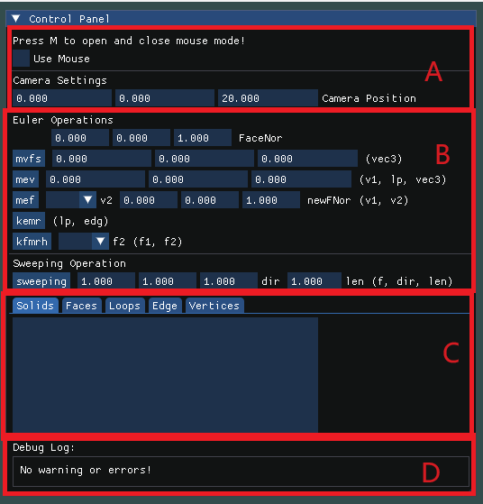
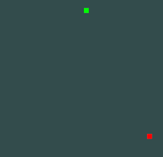
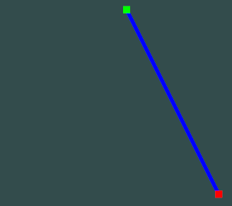
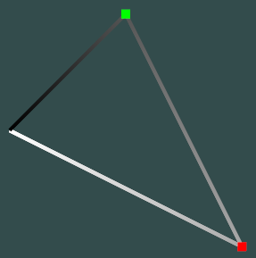
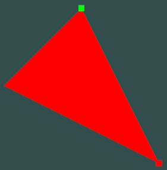
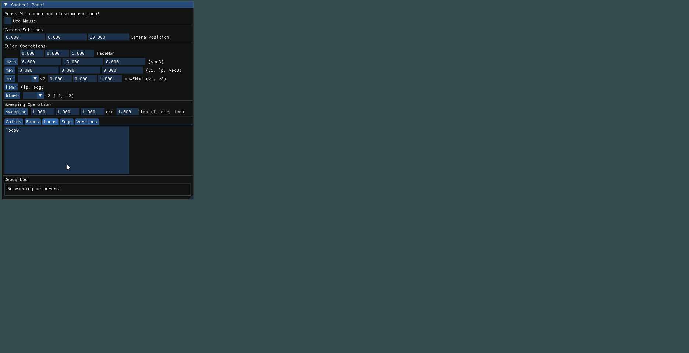
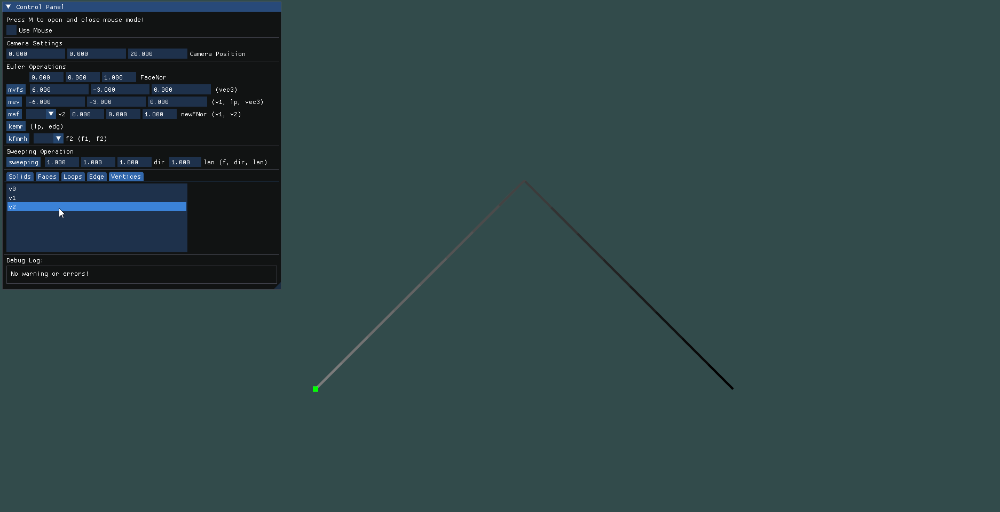
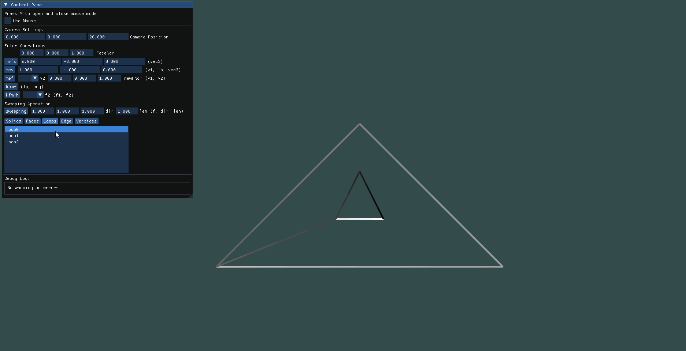
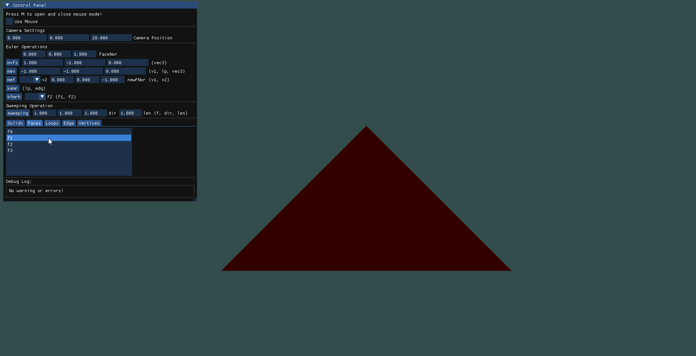

### 项目介绍

该项目以基于边界表示的半边数据结构实现了5个基本的欧拉操作以及平移扫掠操作。该项目中，GUI实现使用了ImGui，渲染使用了OpenGL，计算方面使用了一些数学计算包例如glm, CDT库等。调用库全部都放在`include`，`lib`和`imgui`三个文件夹内。
项目基本内容全部位于`HalfEdge_Structure`文件夹中。欧拉操作具体实现及数据结构基本都在`model.h`和`model.cpp`两个文件里。`glsl`文件夹用于存放shaderProgram。

### 使用流程
  
A.运行程序后，用户可以通过WASDQE来移动摄像机。按下M键或者点击A区域内的check box都可以打开和关闭鼠标模式，在鼠标模式下可以通过鼠标旋转摄像头。  
B.除了摄像机外，其余操作都在左上角的窗口内完成。B区域内是欧拉操作和扫掠操作的接口。在相应位置输入参数后，按下对应按钮以执行对应的欧拉操作或扫掠操作。  
C.很多欧拉操作的参数除了向量或浮点数外，还需要提供对应的拓扑元素。在C窗口下，提供了一个拓扑元素索引列表，选中某个拓扑元素后，openGL就会在窗口中将该拓扑元素渲染出来。其中顶点为红色或绿色，边为蓝色，
环为黑白色(由白到黑代表了它的方向，有些时候半边重合会导致方向不明显或看上去错误），面为红色或绿色(其中亮红色和亮绿色代表面的法向朝向摄像机，暗红和暗绿代表面的法向背对摄像机)，体为深蓝色。
每个元素选中后，可以通过再次选择来取消选中。在每次执行完欧拉操作或扫掠操作后，默认取消所有拓扑元素的选择。
| 点 | 边 | 环 | 面 |
| --- | --- | --- | --- |
|  |  |  | |  

D.DebugLog窗口用于给予用户错误提示等。

### 欧拉操作
`mvfs`: 完整实现为`mvfs`(vec3 `pos`, vec3 `nor`)。`pos`代表新生成的顶点的位置，`nor`代表新生成的面的法向。由于可能存在concave的面以及其他情况，面的法向并不好计算，这里让用户自己维护好不同面的法向。  
`mev`: 完整实现为`mev`(vert `v1`, loop `lp`, vec3 `pos`)。`v1`代表起始顶点，`lp`为目标环，`pos`为新点(这里称它为`v2`)的坐标。下图为示例，我们现在拓扑元素列表中选中对应的点和边，再输入`pos`的值，点击`mev`按钮即可。  
  
`mef`: 完整实现为`mef`(vert `v1`, vert `v2`, vec3 `nor`)。`v1`代表起始点，`v2`代表终点，`nor`代表新面的法线(正如之前所说，在实现上我让用户自己维护面的法线)。该方法中同时定义`v1`到`v2`的走向为原始loop的走向，`v2`到`v1`的方向为新loop的走向。下图为示例，我们在拓扑元素表中选定`v1`，再在`mef`的参数中选择`v2`，最后输入`nor`，点击`mef`按钮即可。  
  
`kemr`: 完整实现为`kemr`(edge `edg`, loop 'lp')。`lp`为想要切开的环，`edg`为该环上的一个边。下图为示例，我们在拓扑元素表中选定`lp`和`edg`，点击`kemr`按钮即可。  
  
`kfmrh`: 完整实现为`kfmrh`(face `f1`, face `f2`)。该操作将使得`f1`变成`f2`的一个环。下图为示例，我们在拓扑元素表中选定`f1`，再在`kfmrh`的参数中选择好`f2`，点击`kfmrh`按钮即可。  
  

### 扫掠操作
`sweeping`: 完整实现为`sweeping`(face `f`, vec3 `dir`, float `len`)。`f`为要执行扫掠的平面。`dir`为扫掠方向，`len`为扫掠长度。以下图为例，在拓扑元素表中选定`f`，输入`dir`和`len`，按下`sweeping`按钮即可。最终的shading效果图也如下所示。    

### 后续优化和改进
* Shading显示上用的是最简单的lambert模型。只考虑了光照角度和平面法向。没有考虑阴影，所以看最终shading效果看起来比较简陋，也有点看不出真实形状。后续可以优化shading算法，加入阴影，贴图等。
* 渲染上，由于有很多带内环的形状或者concave的形状，如何三角化是一大问题。我选择的算法是Constrained Delaunay Triangulation算法(即加上了边这个constrain的Delaunay Triangulation算法)，直接调用了第三方库CDT来生成三角化的模型。但是CDT是一个二维平面的方法，这就限制了我们生成的面上的所有点都必须在同一个平面上。更加优化的办法还有待进一步调研。
* 面的显示上有时候会出错。有些时候是因为loop里存在一条halfEdge都在loop里的edge，使得这个面不标准。有时候是因为两个交点太近，导致这个外部包的CDT的算法报存在相同顶点的错。所以面的渲染和该CDT算法的实现也还有待优化。
* 总体算法实现上还不完善，很多地方仍然需要用户自己去维护其合理性。比如新生成的面的法线需要用户自己判断并维护，生成的图形的几何合理性也需要用户自己维护。
